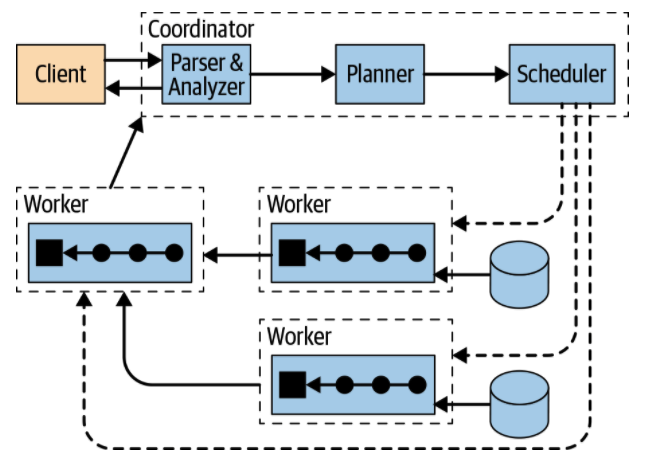
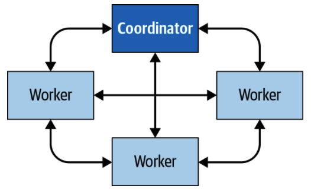
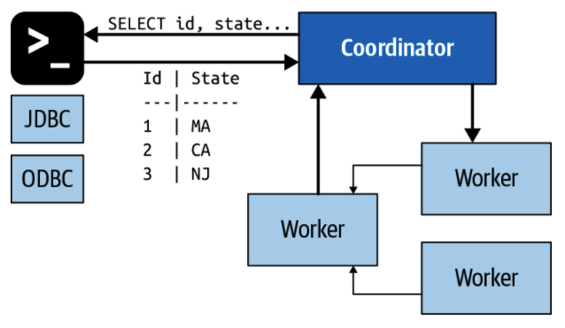
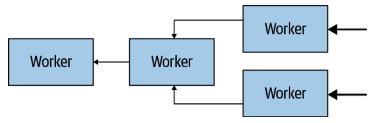
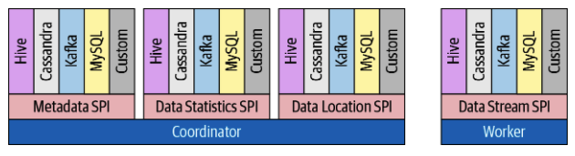
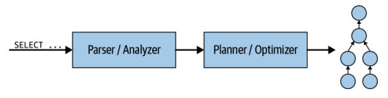
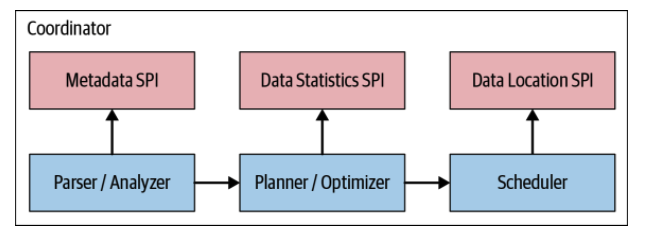
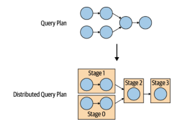
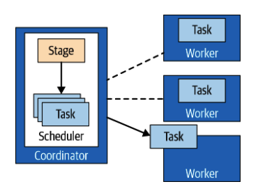

# 4. Presto 技术架构

在前面的章节介绍了 Presto 以及进行了初始安装和使用之后，我们现在讨论 Presto 架构。 我们将深入探讨相关概念，因此您可以了解 Presto 查询执行模型，查询计划和基于代价的优化器。

在本章中，我们首先讨论 Presto 高级架构组件。大致了解 Presto 的工作方式非常重要，特别是如果您打算自己安装和管理 Presto 集群，如第5章所述。

在本章的下半部分，当我们讨论 Presto 的查询执行模型时，我们将更深入地研究这些组件。 如果您需要诊断或调优性能低下的查询（在第8章中进行了讨论），或者您打算为 Presto 开源项目做出贡献，那么这是非常重要的。

## 集群中的 Coordinator 和 Worker

如第2章中所述，首次安装 Presto 时，仅使用一台计算机来运行。这种部署方式无法满足可伸缩性和性能的要求。

Presto 是一个分布式 SQL 查询引擎，类似于大规模并行处理（MPP）的数据库和查询引擎。它无需依赖于运行 Presto 的服务器的垂直扩展，而是能够以水平方式在服务器集群中分布所有处理。这意味着用户可以添加更多节点以获得更多处理能力。

利用这种体系结构，Presto 查询引擎能够跨集群或节点并行处理大数据量的 SQL 查询。 Presto 在每个节点上作为单服务进程运行。运行 Presto 的多个节点（配置为彼此协作）组成一个 Presto 集群。

图4-1描述了由一个协调节点和多个工作节点组成的 Presto 群集。 Presto 用户通过客户端连接到协调节点，例如使用 JDBC 驱动程序或 Presto CLI 工具。然后，协调节点与工作节点协作，工作节点访问数据源。

协调节点（coordinator）负责接收所有的查询，并且管理工作节点去执行查询。

工作节点（worker）负责执行任务并且处理数据。

发现服务（discovery service）通常运行在协调节点上，允许工作节点注册并参与到集群中。

所有节点、客户端之间的通信使用了基于 HTTP/HTTPS 的 REST 协议。

图 4-2 展示了节点间是如何通信的。协调节点与工作节点通信，以分配任务，更新状态，获取最外层的结果返回给用户。工作节点之间也会互相通信，以获取来自其他节点的上游任务的数据。所有的节点都可以从数据源抽取数据。

## Coordinator 协调节点

协调节点负责接收用户的 SQL 查询请求，解析语法，构建执行计划，管理工作节点。它可以说是 Presto 的大脑。用户可以通过 Presto 命令行工具访问；应用程序可以通过 JDBC/ODBC 驱动访问；其他语言编写的程序也可以通过不同的客户端工具访问。协调节点从客户端接收 SQL 语句，比如 `select`。

Presto 运行环境必须包含一个协调节点，以及一个或多个工作节点。在开发及测试环境，这两个角色可以部署在一台机器上。

协调节点持续追踪工作节点的状态，以及捕获查询的执行情况。协调节点创建了一个多阶段的执行模型。

图 4-3 展示了客户端、协调节点、工作节点之间的通信。

一旦接收到 SQL 语句，协调节点就会开始解析、分析、计划，并在工作节点之间分发调度。查询语句会被翻译为一系列运行在整个集群的、相互关联的任务。工作节点处理完成数据后，协调节点将会通过输出缓冲区将数据返回给客户端。一旦客户端完全读取输出缓冲，协调节点就会代表客户端向工作节点请求更多数据。 另外，工作节点与数据源进行交互以从中获取数据。最终，客户端不断请求数据并由工作节点从数据源提供数据，直到查询执行完成。

协调节点和工作节点使用 HTTP 协议通信。

## Discovery Service 发现服务

Presto 使用了发现服务来找到集群中所有的节点。每个 Presto 实例在启动时都会向发现服务注册，并定期发送心跳信号。这允许协调节点拥有可用工作节点的最新列表，并将该列表用于计划查询执行。

如果工作节点无法报告心跳信号，则发现服务将触发故障检测，并且该工作节点将无法再执行其他任务。

为了简化部署并避免运行其他服务，Presto 的发现服务通常是嵌入部署在协调节点。 它与 Presto 共享 HTTP 服务，因此使用相同的端口。

因此，发现服务的工作程序配置通常指向协调节点的主机名和端口。

## Worker 工作节点

Presto 工作节点是 Presto 集群中的服务者。 它负责执行协调器分配的任务并处理数据。工作节点通过使用连接器从数据源获取数据，然后彼此交换中间数据。 最终得到的数据将传递给协调节点。协调节点负责从工作节点那里收集结果并将最终结果提供给客户端。

在安装过程中，工作节点被配置为需要知道集群发现服务的主机名或IP地址。当工作节点的进程启动时，它会向发现服务发布信息，这将使协调程序可以使用它来执行任务。

工作节点使用基于 HTTP 的协议与其他工作节点和协调节点进行通信。

图 4-4 展示了工作节点是如何获取数据，以及相互之间如何协作处理数据，直到将数据传递给协调节点才停止。

## 基于 Connector 的架构

基于 connector 的架构是 Presto 计算存储的核心。connector 使得 Presto 可以连接任意的数据源。

每一个 connector 都对它底层的数据源提供了表级别的抽象。只要一种数据可以被映射成 Presto 中表、列、行的概念，那么就可以创建一个 connector 对该数据进行查询。

Presto 提供了一种服务发现接口（Service Provider Interface，SPI），一种可以实现 connector 的 API。通过在 connector 中实现该接口，Presto 可以在内部连接任意的数据源并执行操作。connector 内部负责处理连接的细节。

每一个 connector 都要实现 API 的三个部分：

* 获取 table/view/schema 元信息的操作
* 使数据根据逻辑单元分区的操作，可以让 Presto 并行读写数据
* 定义数据的 source 和 sink，用于将源数据转换为查询引擎期望的内存格式或从内存格式转换为源数据

Presto 提供了非常多的连接器，比如 HDFS/Hive，MySQL，PostgreSQL，MS SQL Server，Kafka，Cassandra，Redis 等。在第6、第7章，你将接触到这些连接器。可用的连接器种类正在被不断的添加。

Presto 的 SPI 机制同样允许用户创建自己的定制化 connector。当你需要连接的数据源没有已经实现的 connector，这会变得极为有用。当你创建完一个自己的连接器时，我们强烈建议你多和 Presto 开源社区沟通，贡献你的连接器。当你的公司有一个定制化的数据源时，定制连接器也会很重要。这就是 Presto 如何实现 “SQL 查一切“ 功能的过程。

图4-5 展示了 Presto SPI 在 coordinator 中的接口：元数据，数据分析，数据位置；同样，在 worker 中，也有数据处理的接口。

在 Presto 服务启动时，连接器是以插件的形式加载的。在  catalog 的配置文件中配置好以后，就可以从插件的文件夹被加载到。我们在第6章会详细讨论。


提示：Presto 插件化的架构体现在很多方面：事件监听器，权限控制，函数、类型管理，等等。


## Catalogs，Schemas 和 Tables

之前已经讨论过，Presto 使用了基于连接器的架构来处理所有的查询。每一个  catalog 都被配置到了一种数据源上。一个  catalog 中可能有多个 schema。一个 schema 中有多个 table，每个 table 又会提供不同的行、数据类型。我们在第8章会详细讨论。

## 查询执行模型

现在你已经了解了 Presto 集群的构成，以及协调节点和工作节点各自的作用。现在我们看一下 SQL 语句是如何被处理的。


提示：第8、第9章详细描述了 Presto 对 SQL 的支持。


了解查询执行模型可以让你拥有足够的 SQL 查询调优知识。

回想一下，协调节点使用 ODBC 或 JDBC 驱动程序或其他客户端，从命令行接受最终用户的 SQL 语句。然后，协调节点触发工作节点从数据源获取所有数据，创建结果数据集，并将其提供给客户端。

让我们先仔细研究一下协调节点内部发生的情况。将 SQL 语句提交给协调节点后，它将以文本格式接收。协调节点获取该文本并进行解析和分析。 然后，它使用 Presto 中的内部数据结构（称为查询计划）创建执行计划。该流程如图4-6 所示。查询计划概括地表示了处理数据并根据 SQL 语句返回结果所需的步骤。

如图4-7，查询计划生成器使用元数据 SPI 和数据分析 SPI 来创建查询计划。所以协调节点是通过 SPI 直接获取数据源中表的元信息。

协调节点使用元数据 SPI 获取表、列、类型的信息。这些信息被用来验证查询在语义上是合法的，同时被用来在安全检查中进行类型、表达式的验证。

分析 SPI 被用来获取表的行数、表的尺寸大小，以用于构造基于代价的查询计划。

数据位置 SPI 可以加快分布式查询计划的生成。它用来生成表的逻辑切分（split）计划。切片（splits）是并行工作的最小单元。


Presto 中不同的 SPI 更像是概念上的分离； 实际的底层 Java API 以更细粒度的方式由不同的 Java 包分隔。


分布式查询计划是由一个或多个阶段（stage）组成的简单查询计划的扩展。简单查询计划分为多个计划片段。阶段（stage）是计划片段的运行时状态，它包含该阶段的计划片段描述的工作的所有任务。

协调节点分解执行计划，以允许在集群上处理查询，从而使工作节点可以并行执行，从而加快了整体查询的速度。具有多个阶段的查询会导致需要创建阶段的依赖关系树。阶段数取决于查询的复杂性。例如，查询表，返回的列，JOIN 语句，WHERE 条件，GROUP BY 操作和其他 SQL 语句都会影响创建的阶段数。

图 4-8 展示了在集群的协调节点中，逻辑查询计划是如何被转化成分布式执行计划的。

分布式查询计划定义了在 Presto 群集上执行查询的阶段和方式。协调节点使用它来进一步计划和安排整个工作节点的任务。一个阶段包含一个或多个任务。通常，查询过程会涉及许多任务，每个任务处理一部分数据。

协调节点从阶段（stage）中拆解出具体的任务（task），再分配给工作节点，如图 4-9所示。

任务处理的数据单位称为分割（Split）。分割是工作节点可以检索和处理的基础数据段的描述符。它是并行和计算工作分配的基础单位。连接器对数据执行的特定操作取决于基础数据源。

例如，Hive 连接器以路径的形式描述文件的分割，其偏移量和长度指示文件的哪一部分需要处理。

源阶段的任务以页面（page）形式生成数据，这些数据是列格式的行的集合。这些页面流向其他中间下游阶段。交换操作器在阶段之间转移页面（page），交换操作器从上游阶段的任务中读取数据。

源任务使用数据源 SPI 在连接器的帮助下从基础数据源中获取数据。该数据以页面（page）的形式显示给Presto，并在查询引擎中流动。操作器根据其语义来处理和生成页面。例如，过滤操作可以删除行，投影操作可以生成带有新列的页面（page），等等。任务中运算符的序列称为管道。管道的最后一个运算符通常将其输出页放在任务的输出缓冲区中。下游任务中的交换（exchange\) 操作器会消费上游任务输出缓冲区中的页面（page）。所有这些操作在不同的工作线程上并行发生，如图4-10所示。

## 查询计划

## 优化规则

## 执行规则

## 基于代价的优化器

## 处理表分析

## 总结

